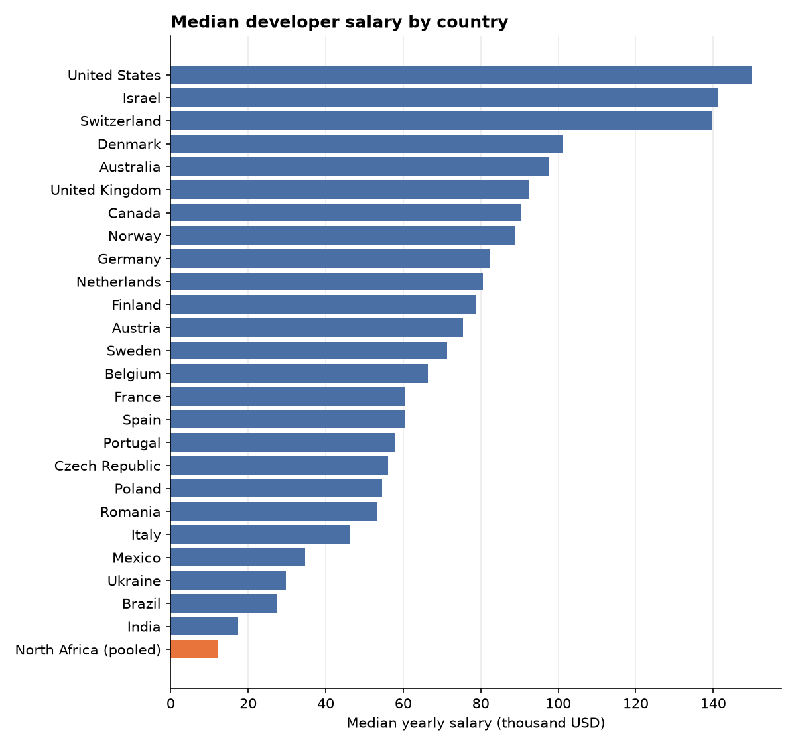
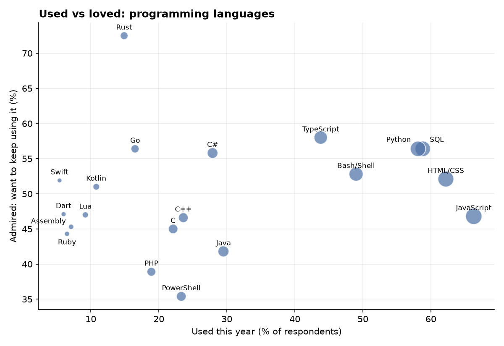
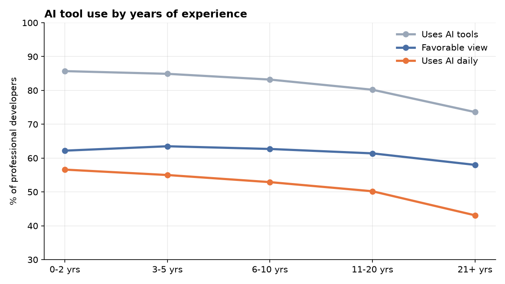

# Developer Survey Insights 2025

What developers earn, where they work and how they use AI, from **49,191 responses** to the
[Stack Overflow Developer Survey 2025](https://survey.stackoverflow.co/), with a focus on **North Africa**.

**[Open the interactive dashboard →](https://naniiic137.github.io/dev-survey-insights/)**


## Key findings

| | Worldwide | North Africa |
|---|---|---|
| Median yearly salary (employed professional developers) | **$77,730** | **$12,246** (n = 68) |
| Use AI tools every day | 50.6% | **74.7%** |
| Work fully remote | 34.4% | 39.7% |

- **North African developers are the heaviest daily AI users** of the regions compared: 74.7%, against 45% in Western Europe and 43.5% in North America.
- **Juniors use AI the most.** Daily use falls from 57% (0–2 years of experience) to 43% (21+ years), while favorable opinions stay around 60% at every level.
- **Popular isn't loved.** JavaScript is used by 66% of respondents, but only 47% want to keep using it. Rust is the most admired language (72.5%).
- **Salaries follow experience**: the worldwide median climbs from $32k (0–2 years) to $110k (21+ years).
- **Work styles differ by region.** Western Europe is mostly hybrid (65%), North America the most remote (48.5%), and North Africa is more remote than the world average, which fits developers working for companies abroad.







## Method

- **Salaries**: employed professional developers reporting a yearly salary converted to USD by Stack Overflow.
  Salaries outside $1,000–$1,000,000 are dropped as entry errors, then per-country outliers outside
  Tukey's fences (1.5 × IQR). 15,685 salaries remain. Medians are used throughout because pay is heavily skewed.
- **Small samples are handled honestly**: countries need at least 50 salaries to be charted, North Africa
  (Tunisia, Morocco, Algeria, Egypt, Libya) is pooled because each country alone is too small, and experience
  groups with fewer than 15 salaries are hidden rather than shown as unreliable medians.
- **"Admired"** follows Stack Overflow's definition: of the people who used a language this year, the share who want
  to keep using it.
- **Regions**: North Africa, Middle East, Western Europe and North America are fixed country lists in
  [`data.py`](src/devsurvey/data.py). Everything else is "Rest of world".

## Run it yourself

```bash
python -m venv .venv
.venv/Scripts/activate          # Windows (on macOS/Linux: source .venv/bin/activate)
pip install -r requirements.txt
python -m devsurvey             # downloads the survey (~140 MB), writes docs/index.html + charts
pytest                          # 22 unit tests, no download needed
```

`python -m devsurvey --year 2024` runs the same analysis on another year's survey.

## Project structure

```
src/devsurvey/
  data.py        download, load, clean, region mapping, salary filtering
  metrics.py     one function per analysis, each returning a small tidy table
  dashboard.py   builds the interactive Plotly dashboard (docs/index.html)
  charts.py      static PNG charts for this README
  __main__.py    runs everything and writes docs/summary.json
tests/           unit tests on small synthetic data
```

**Stack:** Python, pandas, Plotly, matplotlib, pytest, ruff, GitHub Actions, GitHub Pages.

## Data license

The survey data is © Stack Overflow and licensed under the
[Open Database License (ODbL) 1.0](https://opendatacommons.org/licenses/odbl/1-0/). The raw data is not stored in this
repository; it's downloaded when you run the analysis. The derived figures and charts here are produced from it.
This is an independent analysis, not affiliated with Stack Overflow.

The code is released under the [MIT License](LICENSE).
